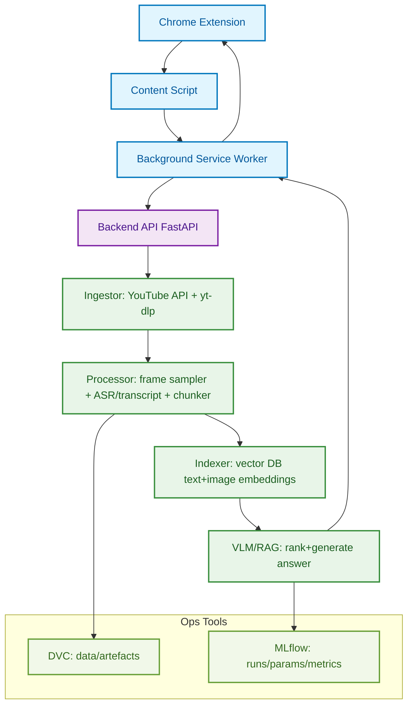
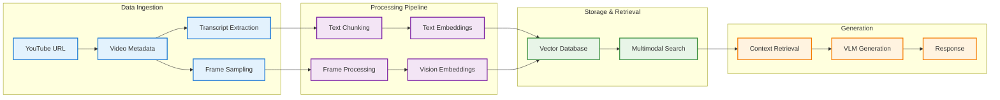

# YouTube Chat Chrome Extension (VLM + RAG)

Chat with any YouTube video using a **Vision‑Language Model (VLM)** + **Retrieval‑Augmented Generation (RAG)** pipeline.

* **Frontend:** Chrome Extension (Manifest v3)
* **Backend:** FastAPI (optional local server) or cloud endpoint
* **ML:** Frame extraction + transcript chunking + multimodal retrieval
* **Ops:** **DVC** for data versioning, **MLflow** on **DagsHub** for experiment tracking
* **APIs:** YouTube Data API v3, (optional) Google Gemini / other VLMs

> MLflow Tracking URI (DagsHub): `https://dagshub.com/Prahaladha-Reddy/YT_RAG.mlflow`

---

## Table of Contents

1. [High‑Level Architecture](#high-level-architecture)
2. [Repo Layout](#repo-layout)
3. [Quick Start](#quick-start)
4. [Environment Variables](#environment-variables)
5. [Chrome Extension Setup](#chrome-extension-setup)
6. [Backend (Optional)](#backend-optional)
7. [Data & Pipelines with DVC](#data--pipelines-with-dvc)
8. [Experiment Tracking with MLflow](#experiment-tracking-with-mlflow)
9. [End‑to‑End Dev Workflow](#end-to-end-dev-workflow)
10. [CI Hints (GitHub Actions)](#ci-hints-github-actions)
11. [Common Tasks / Make Targets](#common-tasks--make-targets)
12. [Troubleshooting](#troubleshooting)
13. [License](#license)

---

## High‑Level Architecture



**Flow:** Extension grabs the YouTube URL → backend pulls transcript & samples frames → builds multimodal chunks → retrieves relevant text+frames → queries a VLM → responds in the extension UI. Data and artefacts tracked in **DVC**; experiments tracked in **MLflow** on **DagsHub**.

---

## Repo Layout

```
.
├─ extension/                 # Chrome extension (Manifest v3)
│  ├─ manifest.json
│  ├─ src/
│  │  ├─ content.js          # Reads video metadata from the page
│  │  ├─ background.js       # Service worker; calls backend
│  │  ├─ popup.html/.js      # Chat UI
│  └─ assets/
│
├─ backend/
│  ├─ app.py                 # FastAPI entry
│  ├─ pipelines/
│  │  ├─ ingest.py           # YouTube API, transcripts
│  │  ├─ frames.py           # Frame sampling
│  │  ├─ chunk.py            # Chunking + metadata
│  │  ├─ embed.py            # Text+image embeddings
│  │  └─ rag.py              # Retrieval + VLM call
│  ├─ models/
│  ├─ utils/
│  └─ requirements.txt
│
├─ data/                     # DVC‑tracked datasets/artefacts (outs)
├─ dvc.yaml                  # Pipeline graph
├─ params.yaml               # Tunables for the pipeline
├─ .dvc/                     # DVC internals
├─ requirements.txt or pyproject.toml
├─ Makefile
└─ README.md
```

---

## Quick Start

```bash
# 0) Python env
uv venv .venv && source .venv/bin/activate   # or use your preferred venv

# 1) Install deps
uv pip install -r backend/requirements.txt
uv pip install "dvc[s3]" dagshub mlflow python-dotenv

# 2) Configure env (see .env example below)
cp .env.example .env && edit .env

# 3) Initialize DVC (first time only)
dvc init

# 4) Point MLflow to DagsHub tracking server
export MLFLOW_TRACKING_URI="https://dagshub.com/Prahaladha-Reddy/YT_RAG.mlflow"
export MLFLOW_TRACKING_USERNAME="Prahaladha-Reddy"
export MLFLOW_TRACKING_PASSWORD="<your_dagshub_token>"

# 5) Run backend
uv run uvicorn backend.app:app --reload --port 8000

# 6) Load the extension (see below) and chat on a YouTube video
```

---

## Environment Variables

Create `.env` at repo root (or use system envs):

```dotenv
# DagsHub / MLflow
MLFLOW_TRACKING_URI=https://dagshub.com/Prahaladha-Reddy/YT_RAG.mlflow
MLFLOW_TRACKING_USERNAME=Prahaladha-Reddy
MLFLOW_TRACKING_PASSWORD=__DAGSHUB_TOKEN__
DAGSHUB_USER_TOKEN=__DAGSHUB_TOKEN__

# If using DagsHub S3 proxy or your own S3 bucket for DVC
AWS_ACCESS_KEY_ID=__OPTIONAL_IF_BUCKET_REQUIRES__
AWS_SECRET_ACCESS_KEY=__OPTIONAL_IF_BUCKET_REQUIRES__
AWS_DEFAULT_REGION=ap-south-1

# YouTube / Google APIs
YOUTUBE_API_KEY=__your_key__
GOOGLE_CLIENT_ID=__optional_oauth__
GOOGLE_CLIENT_SECRET=__optional_oauth__

# VLM / LLM Providers (set what you use)
GEMINI_API_KEY=__optional__
OPENAI_API_KEY=__optional__
COHERE_API_KEY=__optional__

# App
BACKEND_PORT=8000
```

Add `.env` to `.gitignore`.

---

## Chrome Extension Setup

1. Build (or just use the `extension/` folder directly).
2. Open **chrome://extensions** → enable **Developer mode**.
3. **Load unpacked** → select the `extension/` directory.
4. Ensure permissions in `manifest.json` include: `activeTab`, `scripting`, `storage` and host permissions for `https://*.youtube.com/*` and backend URL.
5. Open a YouTube video → click the extension icon → start chatting.

**Minimal Manifest v3 example**

```json
{
  "manifest_version": 3,
  "name": "YouTube Chat (VLM RAG)",
  "version": "0.1.0",
  "action": { "default_popup": "popup.html" },
  "permissions": ["activeTab", "scripting", "storage"],
  "host_permissions": ["https://*.youtube.com/*", "http://localhost:8000/*"],
  "background": { "service_worker": "src/background.js" },
  "content_scripts": [{
    "matches": ["https://*.youtube.com/*"],
    "js": ["src/content.js"],
    "run_at": "document_idle"
  }]]
}
```

---

## Backend (Optional)

Run the FastAPI server locally:

```bash
uv run uvicorn backend.app:app --reload --port 8000
```

Core endpoints (suggested):

* `POST /ingest` → { video\_id | url } → pulls transcript, samples frames, stores artefacts (DVC outs)
* `POST /query` → { video\_id, question, t? } → retrieves relevant chunks + frames → calls VLM → returns answer
* `GET /healthz` → liveness/readiness

---

## Data & Pipelines with DVC

**Why DVC?** Reproducible pipelines + versioned data/artefacts stored remotely (DagsHub/S3) with tiny Git pointers.

### 1) Initialize and add remote

```bash
# First time only
dvc init

# Add a remote pointing to DagsHub (choose *one* style)
# A) Using DagsHub S3 proxy (recommended)
dvc remote add -d dagshub s3://<dagshub-repo-storage-bucket>
dvc remote modify dagshub endpointurl https://dagshub.com
# Typically you only need DAGSHUB_USER_TOKEN (if proxy is enabled for repo)

# B) Using your own S3 bucket
dvc remote add -d s3remote s3://my-bucket/path
# AWS creds from env will be used if required
```

### 2) Define pipeline

`dvc.yaml` (example):

```yaml
stages:
  ingest:
    cmd: uv run python -m backend.pipelines.ingest --url ${url}
    deps:
      - backend/pipelines/ingest.py
    params:
      - ingest.sample_fps
    outs:
      - data/raw/${video_id}
  process:
    cmd: uv run python -m backend.pipelines.frames && uv run python -m backend.pipelines.chunk
    deps:
      - data/raw/${video_id}
      - backend/pipelines/frames.py
      - backend/pipelines/chunk.py
    params:
      - frames.sample_fps
      - chunk.size
    outs:
      - data/processed/${video_id}
  embed:
    cmd: uv run python -m backend.pipelines.embed
    deps:
      - data/processed/${video_id}
      - backend/pipelines/embed.py
    outs:
      - data/index/${video_id}
  rag:
    cmd: uv run python -m backend.pipelines.rag --query "${query}"
    deps:
      - data/index/${video_id}
      - backend/pipelines/rag.py
    outs:
      - data/answers/${video_id}
```

### 3) Reproduce pipeline

```bash
# Set parameter values in params.yaml, or pass via CLI vars
uv run dvc repro
```

### 4) Push artefacts to remote

```bash
uv run dvc push      # pushes outs to configured remote
```

### 5) Pull artefacts

```bash
uv run dvc pull      # pulls required outs for current stage
```

## MLflow Integration

Track experiments with MLflow on DagsHub:

```python
import mlflow
import mlflow.sklearn

# Set tracking URI
mlflow.set_tracking_uri("https://dagshub.com/Prahaladha-Reddy/YT_RAG.mlflow")

# Start an experiment run
with mlflow.start_run():
    # Log parameters
    mlflow.log_param("embedding_model", "sentence-transformers/all-MiniLM-L6-v2")
    mlflow.log_param("chunk_size", 512)
    
    # Log metrics
    mlflow.log_metric("retrieval_accuracy", 0.85)
    mlflow.log_metric("response_time", 2.3)
    
    # Log artifacts
    mlflow.log_artifact("model_outputs/")
```

## Enhanced Pipeline Architecture



---

## End‑to‑End Dev Workflow

1. **Setup**: Clone repo, install dependencies, configure `.env`
2. **Data Pipeline**: Run DVC stages to process video data
3. **Model Training**: Track experiments with MLflow
4. **Extension Development**: Build and test Chrome extension
5. **Integration**: Connect frontend to backend API
6. **Deployment**: Push artifacts with DVC, deploy backend

## Troubleshooting

### Common Issues

- **Mermaid not rendering**: Check for syntax errors, missing quotes, or invalid node names
- **DVC remote issues**: Verify credentials and remote configuration
- **Extension not loading**: Check manifest.json permissions and content script matches
- **API errors**: Validate environment variables and API keys

### Debug Tips

```bash
# Check DVC status
dvc status

# Validate pipeline
dvc dag

# Check MLflow experiments
mlflow ui --backend-store-uri https://dagshub.com/Prahaladha-Reddy/YT_RAG.mlflow

# Test backend
curl http://localhost:8000/healthz
```
